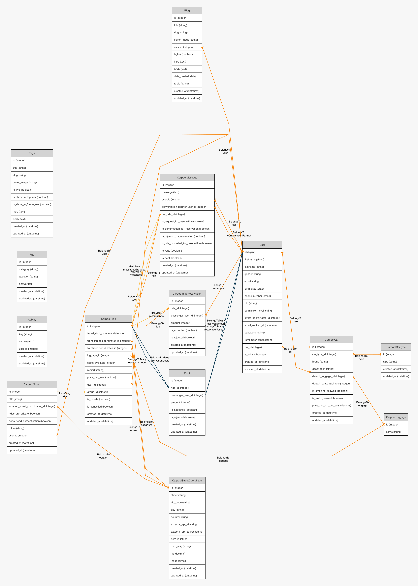

# 1. Tech 

## Framework
Laravel 10  

### Why Choose Laravel?

1. Elegant Syntax & Structure:
Laravel offers clean, readable, and expressive code that makes development faster and more enjoyable.

2. Rapid Development:
Built-in features like authentication, routing, caching, queues, and email handling reduce boilerplate work.

3. Strong Ecosystem:
Laravel comes with Forge, Vapor, Nova, Sail, Horizon, etc., which extend deployment, serverless apps, admin dashboards, and queue management.

4. Community & Support:
One of the largest PHP frameworks, with vast documentation, tutorials, and packages. If you hit a problem, chances are someone has already solved it.

5. MVC Architecture:
Encourages separation of concerns, making applications easier to maintain and scale.

6. Blade Templating Engine:
Simple yet powerful for building dynamic, reusable UI components.

7. Security Features:
Built-in CSRF protection, hashed passwords, encryption, and secure authentication flows.

## (Server) Requirements
- PHP ^8.1
- Composer
- Node.js & NPM
- MySQL/Postgres (or your preferred database)
- Laravel 10
- Laravel Livewire ^3.x
- MySQL v5.7+
More info https://laravel.com/docs/10.x/deployment#server-requirements

## Installation
1. Clone the repository:
```
git clone https://github.com/Telraam-Rear-Window-BV/ecomobilis.git
cd your-project
```
2.Install PHP dependencies: composer install
3.Install front-end dependencies: see below
4.Copy the environment file and configure:
```
cp .env.example .env
php artisan key:generate
```
5. Import database (resources/setup-files-db-etc/full-db-structure-2025-09-25.sql)

## Frontend (Laravel mix)
- Where to edit:  uses the files resources/js/main.js and resources/sass/...
- Paths and files for css and js etc defined in webpack.mix.js + config with package.json
- Compile it with: npm run watch / npm run production

## Jobs
To start it locally:
-  `php artisan queue:listen database --tries=1`

## Commands
- `php artisan CarpoolSendUserUpcomingRides:daily`
This runs through a cron job on the server (* * * * * php /data/sites/web/ecomobilisbe/laravelproject/artisan schedule:run)

## How to get streets?
- https://locationiq.com/demo#autocomplete -->  uses open street maps

## JS packages
- Autocomplete js package used for street lookup https://github.com/TarekRaafat/autoComplete.js
- Leaflet for the maps, open source package for Open Street map
- 
## Laravel packages
- https://github.com/msurguy/Honeypot/tree/master
- Laravel ER Diagram Generator

## Laravel livewire
This project uses Laravel Livewire  for reactive components.
Tyical workflow:
Create components with`php artisan make:livewire ExampleComponent`
Components live in app/Http/Livewire/ with corresponding Blade views in resources/views/livewire/.
Use components in Blade templates with:
`<livewire:example-component />`


# 2. Database

Initially we were aiming for a NOSQL database - because there were signs the data-structure needed to be very flexible - however we choose for MySQL. 
The developed carpooling modules benefit from relationships between the tables. Relational features (foreign keys, joins, ...) enforce data integrity that NoSQL often lacks.
Almost every hosting provider supports MySQL out of the box and has in general and is a free, open-source, and widely understood..


(Generated with https://github.com/beyondcode/laravel-er-diagram-generator)

Updates are atm not done with migrations but documented sql commands. 
Those can be found in resources/setup-files-db-etc/queries.sql. The current base database structure is also documented in resources/setup-files-db-etc/

# 3. Carpool

## Locations
To get locations we use the external Locationiq api. This service uses Open Street Maps and has options for streets, city based on a search query.
So it converts a structured or free-form address to geographical coordinates. We screened for fully open and free location services but there are none. LocationIQ seems suited and most clear pricing. 
It can be used for free for a 5000 requests /day and 2 requests / sec.
When a location is submitted we store the coordinates in the db table carpool_street_coordinates to be able to reference to that location.
Locationiq was the based option after review of the available tools.

## Cities autocomplete
The UI for the location selection (the dropdown) uses the open source vanilla javascript  library https://github.com/TarekRaafat/autoComplete.js.
We store the json in a hidden field below the input field. It's the hidden field we use in the database.

## Price calculate
When a price is calculated we use the "la distance en bref" + 20%. 
We multiply it with the provided price per km from the user.

## Messages
A message thread is always linked towards a specific ride. The thread forms itself by combining the sender (user_id), receiver (conversation_partner_user_id) and the ride (car_ride_id)

There is a special type of message, the 'auto-message' which is basically a message triggered by an external request, eg a request for a car ride. The auto message appears in the thread with a fixed message in a slightly different layout.

## Mails
- When a reservation is requested (event CarpoolRequested)
- When a reservation is confirmed (event CarpoolReservationAccepted)
- When a reservation is rejected (event CarpoolReservationRejected)
- When a chat happened (job CarpoolMessageAdded)
- Every morning overview of your upcoming rides (Console/Kernel - carpoolSendUserUpcomingRides:daily 06:00) 

## Carpool matching
Matching is done based on the stored gps coordinates and looks within 20km radius for both departure and arrival and for your the date / hour given or later


# 4. API

The API is open and documented:
https://documenter.getpostman.com/view/12029054/2sB3HrnHiF#6039ffb3-d303-4833-b58c-43d088177f13


# 5. Project Structure

Laravel is an advanced MVC framework. The default structure has been followed.


# 6. Hosting

The hosting of http://ecomobilis.be/ is at Combell (combell.com). (S)FTP access can be provided, just email dave@telraam.net

# 7. Deployment

Ensure .env is configured for production.

Run:
```
composer install --optimize-autoloader --no-dev
php artisan config:cache
php artisan route:cache
php artisan view:cache
npm run build
```


# 8. Design 

## Fonts
- DM Sans as main font (https://fonts.google.com/specimen/DM+Sans)
- Barlow Condensed for narrow headers (https://fonts.google.com/specimen/Barlow+Condensed)

## Color scheme
Main dark blue: #263d5e
Accent orange : #F2845C
Background beige: #faf6f2


# 9. GDPR

- we only use essential cookies (for authentication) and do not track or collect any additional data
- we use the privacy friendly plausible.io for visitor tracking. More about Plausible and GDPR can be found here https://plausible.io/data-policy
- privacy policy https://ecomobilis.be/page/privacy-policy
- terms and conditions: https://ecomobilis.be/page/terms-of-use
- A user can immediately erase his user account without manual intervention. His personal data will be removed instantly.


# 10. Admin panel

There is a seperate repository for admin use only. It can be found on: 
https://github.com/Telraam-Rear-Window-BV/ecomobilis-admin

Why Filament? Laravel Filament is a modern admin panel and toolkit for Laravel that makes building internal dashboards and back-office applications fast and elegant. It provides a clean, intuitive interface with ready-made CRUD functionality, form builders, and tables out of the box, all while staying highly customizable. By running it in a separate repository, we keep our core application clean and modular while still benefiting from Filament’s powerful features for managing data, users, and system configurations efficiently.


# 11. Native iOS and Android apps

Besides the web application there is also a light weight app for iOS and Android: 
https://github.com/Telraam-Rear-Window-BV/ecomobilis-mobile-app

It has no authentication build in but shows a good introduction to the project.
We used Expo, a framework for building native mobile applications using React Native. Expo offers a unified workflow for both iOS and Android. 
By maintaining it in a separate repository, we decouple the mobile app from the Laravel backend, ensuring a clear separation of concerns. This setup allows the Expo app to focus entirely on delivering a smooth, performant mobile experience while consuming APIs from our core services. The result is faster development, easier maintenance, and the flexibility to evolve mobile features independently of the backend.


# 12. Data

## The list of datasets used:
- we use Open Street Map maps and location through locationiq 

## The list of datasets generated/opened
- the interesting datasets are opened up via the api

## The list and exports of data that can be automatically exported to the ODWB portal
The data is open, and available through the api
